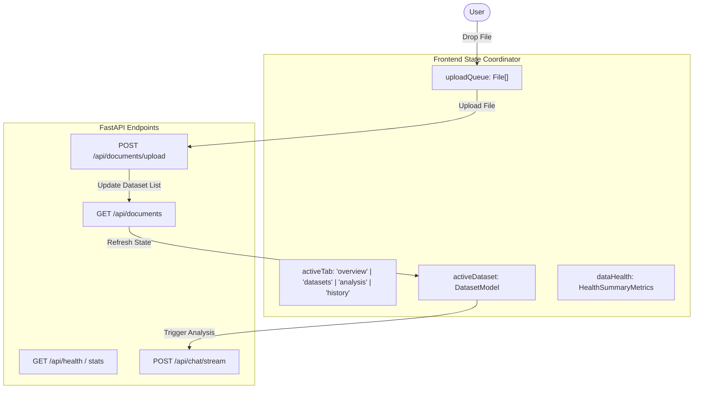

# 🎨 AI-Based EDA Assistant — Frontend Design Specification (`changefronted.md`)

This document provides an exhaustive design and architectural breakdown of the **AI-Based EDA Assistant Overview & Analytics Dashboard** interface.

---

## 📑 Table of Contents
1. [Executive Overview](#1-executive-overview)
2. [Layout & Grid Architecture](#2-layout--grid-architecture)
3. [Design System & Visual Language](#3-design-system--visual-language)
4. [Component-by-Component Specification](#4-component-by-component-specification)
   - [4.1 Left Navigation Sidebar](#41-left-navigation-sidebar)
   - [4.2 Top Global Header](#42-top-global-header)
   - [4.3 Executive KPI Metrics Bar](#43-executive-kpi-metrics-bar)
   - [4.4 Recent Datasets Table](#44-recent-datasets-table)
   - [4.5 Recent Activity Feed](#45-recent-activity-feed)
   - [4.6 Data Health Summary](#46-data-health-summary)
   - [4.7 Quick Start Actions Grid](#47-quick-start-actions-grid)
   - [4.8 Drag-and-Drop Ingestion Target](#48-drag-and-drop-ingestion-target)
5. [State Management & Data Flow](#5-state-management--data-flow)
6. [Implementation Blueprint](#6-implementation-blueprint)

---

## 1. Executive Overview

The **AI-Based EDA Assistant** dashboard is a high-density, enterprise-grade data management and exploratory data analysis portal. It serves as the master command center for uploading datasets, monitoring data quality, tracking storage quotas, managing document lifecycles, and launching interactive conversational AI analyses.

### Core Objectives:
- **Instant Situational Awareness**: Display high-level KPIs (total datasets, total rows, storage usage, data health scores) within the initial viewport.
- **Seamless Dataset Lifecycle**: Single-click access to recent files, preview modals, status indicators, and export actions.
- **Frictionless Ingestion**: High-visibility drag-and-drop file target supporting CSV, Excel, JSON, and ZIP archives up to 100MB.

---

## 2. Layout & Grid Architecture

The interface uses a multi-tier dashboard layout:

```
+---------------------------------------------------------------------------------------------------------+
| [LOGO] AI-Based EDA      | Header: Greeting / Active Dataset Dropdown / Export Report / Notifications   |
+--------------------------+------------------------------------------------------------------------------+
| WORKSPACE                | [KPI 1: Datasets] [KPI 2: Rows] [KPI 3: Storage] [KPI 4: Analyses] [KPI 5: Q] |
|  (•) Overview            +-----------------------------------------------+------------------------------+
|  [ ] Datasets            | Recent Datasets Table                         | Recent Activity Feed         |
|  [ ] Analysis            | - Sales_2024.csv    (50,432 rows) [Ready]     | - Sales_2024.csv analyzed    |
|  [ ] History             | - HR_Employees.xlsx (12,842 rows) [Ready]     | - HR_Employees.xlsx uploaded |
|                          | - Customer_Complaints.json        [Ready]     | - Report exported            |
| SYSTEM                   +-----------------------------------------------+------------------------------+
|  [ ] Storage             | Data Health Summary (All Datasets)            | Quick Start (2x2 Grid)       |
|  [ ] Settings            | - Missing Values  - Duplicates Removed        | [ Upload ]   [ View Data ]   |
|                          | - Column Standards - Quality Score (92/100)   | [ Analyze]   [ History   ]   |
| [Active Dataset Card]    +------------------------------------------------------------------------------+
| [User Profile Card]      | [ Drag & Drop Ingestion Target: CSV, Excel, JSON, ZIP (Max: 100MB) ]         |
+--------------------------+------------------------------------------------------------------------------+
```

---

## 3. Design System & Visual Language

### 3.1 Color Palette
- **Backgrounds**:
  - App Canvas: `#f8fafc` (Soft cool slate)
  - Sidebar / Cards: `#ffffff` (Pure white)
  - Card Border: `#e2e8f0` (Subtle divider border)
- **Primary & Accent Colors**:
  - Primary Brand Blue: `#2563eb` (Royal Blue)
  - Success / Growth Green: `#10b981` (Emerald Green)
  - Storage Purple: `#8b5cf6` (Violet)
  - Analytics Orange: `#f59e0b` (Amber Orange)
  - Quality Teal: `#06b6d4` (Cyan Teal)
- **Typography & Neutral Scales**:
  - Primary Text: `#0f172a` (Slate 900)
  - Secondary Text: `#64748b` (Slate 500)
  - Muted / Disabled: `#94a3b8` (Slate 400)

### 3.2 Typography & Spacing
- **Font Family**: `'Inter', system-ui, -apple-system, sans-serif`
- **Border Radius**:
  - Cards & Containers: `12px - 14px`
  - Buttons & Inputs: `8px - 10px`
  - Badges & Pills: `9999px` (Full rounded capsule)
- **Shadows**:
  - Card Shadow: `0 1px 3px 0 rgba(0, 0, 0, 0.05), 0 1px 2px -1px rgba(0, 0, 0, 0.05)`
  - Elevated Hover Shadow: `0 4px 6px -1px rgba(0, 0, 0, 0.08), 0 2px 4px -2px rgba(0, 0, 0, 0.05)`

---

## 4. Component-by-Component Specification

### 4.1 Left Navigation Sidebar (~260px Width)
1. **Brand Header**: Multi-bar chart icon + bold title `"AI-Based EDA Assistant"`.
2. **Navigation Categories**:
   - `WORKSPACE`:
     - **Overview** (Active: highlighted blue pill with icon).
     - **Datasets** (Table view / document management).
     - **Analysis** (Chat interface, RAG streaming, source reader).
     - **History** (Archived conversation turns).
   - `SYSTEM`:
     - **Storage** (Storage driver status, quotas, Pinecone namespace usage).
     - **Settings** (API keys, model parameters, chunking configuration).
3. **Active Dataset Floating Card**:
   - Anchored in lower sidebar section.
   - Displays active target: `Sales_2024.csv`, `CSV • 50,432 rows`, `9 columns • Ready`.
   - Action: `View Preview` button + collapse chevron.
4. **User Profile Section**:
   - Avatar circle with initials (`RS`).
   - User Name (`Raj Singh`).
   - Connection status indicator (`● Local Mode`).

---

### 4.2 Top Global Header
- **Greeting & Breadcrumbs**:
  - Main title: `"Overview"`.
  - Subtitle: `"Welcome back, Raj Singh"`.
- **Action Controls**:
  - **Active Dataset Dropdown**: Displays current file badge (`Sales_2024.csv [Ready]`) allowing instant switching between indexed datasets.
  - **Export Report Button**: Primary outlined button with download icon.
  - **Notification Badge**: Bell icon with unread indicator count badge (`3`).

---

### 4.3 Executive KPI Metrics Bar (5 Metric Cards)
A responsive 5-column horizontal grid summarizing global system statistics:

| Card | Primary Value | Subtitle / Trend | Icon / Color Theme |
|---|---|---|---|
| **Total Datasets** | `7` | `+2 this week` | Blue Database Icon (`#2563eb`) |
| **Total Rows** | `248,531` | `+18,542 this week` | Green Spreadsheet Icon (`#10b981`) |
| **Storage Used** | `1.42 GB` | `of 5 GB` + Progress Bar | Purple Storage Icon (`#8b5cf6`) |
| **Total Analyses** | `36` | `+8 this week` | Orange Analytics Chart (`#f59e0b`) |
| **Data Quality** | `Good` | `Avg. Score 92/100` | Teal Security Shield (`#06b6d4`) |

---

### 4.4 Recent Datasets Table (60% Width)
- **Header**: Title `"Recent Datasets"` + `"View All"` button.
- **Columns**: `Dataset Name`, `Rows`, `Columns`, `Uploaded`, `Status`, `Action`.
- **Sample Records**:
  - `Sales_2024.csv` | 50,432 | 9 | May 21, 2024 | `[Ready]` (Green) | `⋮`
  - `HR_Employees.xlsx` | 12,842 | 7 | May 20, 2024 | `[Ready]` (Green) | `⋮`
  - `Customer_Complaints.json` | 8,921 | 6 | May 18, 2024 | `[Ready]` (Green) | `⋮`
  - `Market_Research.zip` | 25,103 | 11 | May 16, 2024 | `[Processed]` (Blue) | `⋮`
  - `Inventory_May.csv` | 15,230 | 8 | May 15, 2024 | `[Ready]` (Green) | `⋮`

---

### 4.5 Recent Activity Feed (40% Width)
- **Header**: Title `"Recent Activity"` + `"View All"` button.
- **Feed Elements**:
  - `Sales_2024.csv analyzed` — *"Top 5 products by sales"* (`2 min ago`)
  - `HR_Employees.xlsx uploaded` — *"12,842 rows processed"* (`1 hour ago`)
  - `Customer_Complaints.json analyzed` — *"Complaint category distribution"* (`3 hours ago`)
  - `Report exported` — *"Sales_2024_Analysis.pdf"* (`5 hours ago`)
  - `Market_Research.zip processed` — *"3 files extracted"* (`1 day ago`)

---

### 4.6 Data Health Summary
- **Header**: Title `"Data Health Summary (All Datasets)"` + `"View Details"` button.
- **Metrics Grid (5 Columns)**:
  - **Missing Values**: `1,248` (`↓ 12% vs last week`)
  - **Duplicates Removed**: `5,642` (`↓ 8% vs last week`)
  - **Columns Standardized**: `34` (`↑ 5% vs last week`)
  - **Dates Standardized**: `18` (`↑ 3% vs last week`)
  - **Quality Score**: `92/100` (`↑ 4% vs last week`)

---

### 4.7 Quick Start Actions (2×2 Matrix)
Four action cards providing one-click access to primary user workflows:
1. **Upload Dataset** — *"Add new data"* (Upload icon).
2. **View Datasets** — *"Manage your data"* (Grid icon).
3. **Start Analysis** — *"Ask questions"* (Analytics spark icon).
4. **View History** — *"See past analyses"* (Clock icon).

---

### 4.8 Drag-and-Drop Ingestion Target
- Full-width card with dashed blue outline (`#3b82f6` border).
- Cloud upload icon.
- Call to Action: `"Drop your data here or click to browse"`.
- Supported formats descriptor: `"CSV, Excel, JSON, ZIP • Max file size: 100MB"`.
- Primary CTA Button: `"Upload Dataset"`.

---

## 5. State Management & Data Flow



---

## 6. Implementation Blueprint

### Key Component File Structure:
```
frontend/
├── app/
│   ├── layout.tsx                # Master root layout with Inter typography
│   ├── globals.css               # Design tokens, variables & responsive grid
│   └── page.tsx                  # Tab state coordinator (Overview vs Analysis)
│
├── components/
│   ├── dashboard/
│   │   ├── OverviewDashboard.tsx  # Master Overview view combining all modules
│   │   ├── MetricCardsRow.tsx     # 5 Executive KPI cards
│   │   ├── RecentDatasetsTable.tsx # Data table with status pills & format icons
│   │   ├── ActivityTimeline.tsx   # Chronological activity stream
│   │   ├── DataHealthSummary.tsx  # Dataset hygiene & quality score card
│   │   ├── QuickStartGrid.tsx     # 2x2 Action matrix cards
│   │   └── PersistentUpload.tsx   # Dashed upload dropzone
│   │
│   ├── layout/
│   │   ├── AppSidebar.tsx         # Left navigation rail (~260px)
│   │   └── AppHeader.tsx          # Top greeting & dataset switcher bar
│   │
│   └── workspace/
│       ├── ChatWindow.tsx         # Conversational Q&A workspace
│       └── SourceViewer.tsx       # Markdown reader with coordinate highlights
```

---
*Created for EDA Assistant Project | Master Frontend Specification*
